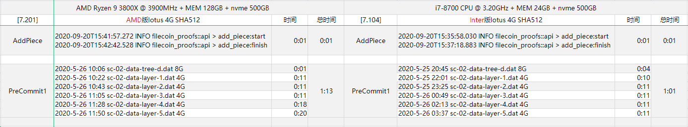

# 3800X/i7-8700 SHA512 bench log




1. [AMD Ryzen 9 3800X @ 3900MHz](./bench-sha512-3800X.log) bench log
2. [Inter i7-8700 CPU @ 3.20GHz](./bench-sha512-i7-8700.log) bench log


Bench使用方法参考：https://github.com/filecoincash/filecoincash_doc/bench/

> cat bench.sh
```
nohup env FIL_PROOFS_USE_GPU_COLUMN_BUILDER=1 FIL_PROOFS_USE_GPU_TREE_BUILDER=1 RUST_LOG=info ./benchy prodbench --config config.json > log-bench.log 2>&1 &
```

> cat config.json
```
{
	"sector_size" : "4294967296",
	"porep_challenges" : 2,
	"porep_partitions" : 1,
	"post_challenges" : 20,
	"post_challenged_nodes" : 2,
	"stacked_layers" : 5,
	"num_sectors" : 1
}
```

